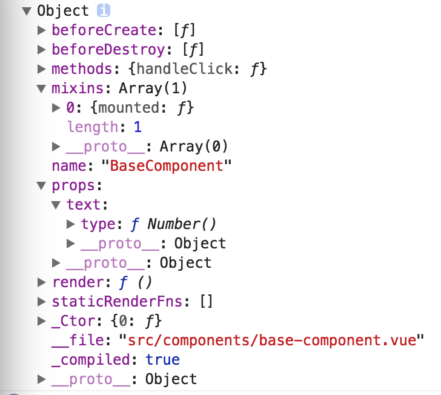

##Vue的component组件机制剖析

### Vue的组件到底是什么？？
平常我们使用类似如下
```
import *** from '**/**'
```
的方式获取单文件组件，里面的内容如下：
```
&lt;template&gt
  &lt;div&gt;&lt;/div&gt;
&lt;/template&gt
&lt;script&gt
  export default {
    data () {
      return {}
    }
  }
&lt;/script&gt;
&lt;style&gt;&lt;/style&gt
```
但是在JS中"一切皆对象"，那么组件到底是对象吗？，可以打印这个引用组件的对象看看其形式：<br>

这里我们可以看出单文件组件是一个包含钩子函数，props属性以及方法等的对象，后面会提到组件其实最终是函数。

### template组件如何在Vue里面被解析呢？
当组件import后，会要注册为
```
components: {
  ***: ***
}
```
实际上Vue此时会替换template模板内容,然后进行模板渲染，这其中包括了编译成AST语法树，再转换为render函数过程，最终返回一个VNode。

* 模板template渲染过程
首先根据参数template属性生成render函数,此过程发生在Vue实例初始化时：
```
function Vue (options) {
  this._init(options)
}

Vue.prototype._init = function (options) {
  var vm = this;
  //参数el属性存在，就调用mount方法；初始化时也可以不传el属性，后续调用mount方法
  if (vm.$options.el) {
      vm.$mount(vm.$options.el)
  }
}
```
在mounted阶段执行由compileToFunctions将template转换为render函数如下：
```
  Vue.prototype.$mount = function () {
    var ref = compileToFunctions(template, {
      shouldDecodeNewlines: shouldDecodeNewlines,
      delimiters: options.delimiters,
      comments: options.comments
    }, this);
    //由template参数得到render方法
    var render = ref.render;   
    //由template参数得到最大静态渲染树
    var staticRenderFns = ref.staticRenderFns;
  }
```
compileToFunctions生成render的方法如下：
```
  var ast = parse(template.trim(), options);
  optimize(ast, options);
  var code = generate(ast, options);
```
* template字符串通过parse函数将str转换成AST(抽象语法树)对象，其实也就是由正则表达式将str转换成AST树的结构对象:
```
  function parse(template) {
          var currentParent;    //当前父节点
          var root;            //最终返回出去的AST树根节点
          var stack = [];      //一个栈辅助树的建立
          parseHTML(template, {
              start: function start(tag, attrs, unary) {
                 ......
              },
              end: function end() {
                ......
              },
              chars: function chars(text) {
                 ......
              }
          })
          return root
      }
```
来看parseHTML方法
```
   function parseHTML(html, options) {
          var stack = [];    //这里和上面的parse函数一样用到stack这个数组 不过这里的stack只是为了简单存放标签名 为了和结束标签进行匹配的作用
          var isUnaryTag$$1 = isUnaryTag;   //判断是否为自闭合标签
          var index = 0;
          var last;
          while (html) {
              //　　第一次进入while循环时，由于字符串以<开头，所以进入startTag条件，并进行AST转换，最后将对象弹入stack数组中
              last = html;
              var textEnd = html.indexOf('<');
              if (textEnd === 0) {     // 此时字符串是不是以<开头
                  // End tag:
                  var endTagMatch = html.match(endTag);
                  if (endTagMatch) {
                      var curIndex = index;
                      advance(endTagMatch[0].length);
                      parseEndTag(endTagMatch[1], curIndex, index);
                      continue
                  }
  
                  // Start tag:    // 匹配起始标签
                  var startTagMatch = parseStartTag();    //处理后得到match
                  if (startTagMatch) {
                      handleStartTag(startTagMatch);
                      continue
                  }
              }
  
              // 初始化为undefined 这样安全且字符数少一点
              var text = (void 0), rest = (void 0), next = (void 0);
              if (textEnd >= 0) {      // 截取<字符索引 => </div> 这里截取到闭合的<
                  rest = html.slice(textEnd);  //截取闭合标签
                  // 处理文本中的<字符
                  // 获取中间的字符串 => {{message}}
                  text = html.substring(0, textEnd); //截取到闭合标签前面部分
                  advance(textEnd);               //切除闭合标签前面部分
              }
              // 当字符串没有<时
              if (textEnd < 0) {
                  text = html;
                  html = '';
              }
              // // 处理文本
              if (options.chars && text) {
                  options.chars(text);
              }
          }
     }
```
advance函数: 修改当前处理标记索引，并且将html已处理部分截取
```
    // 该函数将函数局部变量index往前推 并切割字符串
    function advance(n) {
        index += n;
        html = html.substring(n);
    }
```
parseStartTag函数: 处理开始标签，将属性放入attrs中，如
```
template = &lt;div id="app">&lt;div>&lt;span>{{message}}&lt;/span>&lt;/div>&lt;/div&gt;
```
程序第一次进入该函数 匹配的是div标签 所以tagName就是div，start：0 end:14，如图：

```
  function parseStartTag () {
      const start = html.match(startTagOpen)
      if (start) {
        const match = {
          tagName: start[1],
          attrs: [],
          start: index
        }
        // 处理完头部信息，将头部移除掉
        advance(start[0].length)
        let end, attr
        // 循环找尾部【>】，如果没有到尾部时，就向attrs中添加当前正则匹配出的属性。
        while (!(end = html.match(startTagClose)) && (attr = html.match(attribute))) {
          advance(attr[0].length)
          match.attrs.push(attr)
        }
        // 将尾部【>】从html中移除，记录当前处理完的索引
        if (end) {
          match.unarySlash = end[1]
          advance(end[0].length)
          match.end = index
          return match
        }
      }
    }
```
handleStartTag: 将parseStartTag处理的结果循环转换为：

最后通过options.start生成ast node
```
/**
   * @param {*} match 通过parseStartTag处理的结果
   */
  function handleStartTag (match) {
    const tagName = match.tagName
    ...
    if (options.start) {
      options.start(tagName, attrs, unary, match.start, match.end)
    }
  }
```
以上是处理起始标签，循环处理其子节点，判断节点的内容使用chars函数处理，最后再由parseEndTag函数处理结束标签。
parseEndTag函数: 处理结束标签
```
  /**
    * @param {*} tagName 标签名
    * @param {*} start 在html中的起始位置
    * @param {*} end 在html中结束位置
  */
  function parseEndTag (tagName, start, end) {
      let pos, lowerCasedTagName
      if (start == null) start = index
      if (end == null) end = index
  
      if (tagName) {
        lowerCasedTagName = tagName.toLowerCase()
      }
  
      // Find the closest opened tag of the same type
      // 从stack中找到与当前tag匹配的节点，这里利用倒序匹配最近的
      if (tagName) {
        for (pos = stack.length - 1; pos >= 0; pos--) {
          if (stack[pos].lowerCasedTag === lowerCasedTagName) {
            break
          }
        }
      } else {
        // If no tag name is provided, clean shop
        pos = 0
      }
  
      if (pos >= 0) {
        // Close all the open elements, up the stack
        for (let i = stack.length - 1; i >= pos; i--) {
          if (process.env.NODE_ENV !== 'production' &&
            (i > pos || !tagName) &&
            options.warn
          ) {
            options.warn(
              `tag <${stack[i].tag}> has no matching end tag.`
            )
          }
          if (options.end) {
            options.end(stack[i].tag, start, end)
          }
        }
  
        // Remove the open elements from the stack
        stack.length = pos
        lastTag = pos && stack[pos - 1].tag
        // 处理br
      } else if (lowerCasedTagName === 'br') {
        if (options.start) {
          options.start(tagName, [], true, start, end)
        }
        // 处理p标签
      } else if (lowerCasedTagName === 'p') {
        if (options.start) {
          options.start(tagName, [], false, start, end)
        }
        if (options.end) {
          options.end(tagName, start, end)
        }
      }
    }
  }
```
这个过程主要是将template字符串转换为树的结构，AST对象的基本结构为：

然后对AST结构进行优化，找出AST对象中所有的最大静态子树
```
  function optimize(root, options) {
      if (!root) {
          return
      }
      // 缓存静态标签
      isStaticKey = genStaticKeysCached(options.staticKeys || '');
      isPlatformReservedTag = options.isReservedTag || no;
      // 标记非静态节点
      markStatic$1(root);
      // 标记静态节点
      markStaticRoots(root, false);
  }
  function optimize (root, options) {
    //将ast对象的所有节点标记为是否静态
    markStatic(root);
    markStaticRoots(root, false);
  }
  function markStatic (node) {
    //当前节点是否静态
    node.static = isStatic(node);
    //递归标记node的子节点是否静态
    for (var i = 0, l = node.children.length; i < l; i++) {
      var child = node.children[i];
      markStatic(child);
      //只要有一个子节点非静态，父节点也非静态
      if (!child.static) {
        node.static = false;
      }
    }
  }
  function markStaticRoots (node, isInFor) {
      //将包含至少一个非文本子节点（node.type === 3代表文本节点）的节点标记为最大静态树的根节点
      if (node.static && node.children.length && !(
        node.children.length === 1 &&
        node.children[0].type === 3
      )) {
        node.staticRoot = true;
        return
      } else {
        node.staticRoot = false;
      }
      //当前node节点不是静态根节点，递归判断子节点
      if (node.children) {
        for (var i = 0, l = node.children.length; i < l; i++) {
          markStaticRoots(node.children[i], isInFor || !!node.for);
        }
      }
  }
```
再由generate函数将AST树转换为render方法的字符串, _c表示createElement
```
  function generate(ast, options) {
      // 保存上一个属性值
      var prevStaticRenderFns = staticRenderFns;
      ...
      // 将ast对象转换为字符串
      var code = ast ? genElement(ast) : '_c("div")';
      staticRenderFns = prevStaticRenderFns;
      onceCount = prevOnceCount;
      return {
          render: ("with(this){return " + code + "}"),
          staticRenderFns: currentStaticRenderFns
      }
  }
```
最后生成

generate函数生成的总的对象为：

此时在返回到compileToFunctions
```
  function compileToFunctions(template, options, vm) {
      options = options || {};

      /* new Function检测 */

      /* 缓存查询 */

      // compile
      var compiled = compile(template, options);

      /* 输出返回的error和tips */

      // 将字符串代码转化为函数
      var res = {};
      var fnGenErrors = [];
      // 将render字符串转换为函数
      res.render = makeFunction(compiled.render, fnGenErrors);
      var l = compiled.staticRenderFns.length;
      res.staticRenderFns = new Array(l);
      for (var i = 0; i < l; i++) {
          res.staticRenderFns[i] = makeFunction(compiled.staticRenderFns[i], fnGenErrors);
      }

      /* checkError */
      // 由于res.staticRenderFns是空，所以最后直接把该res缓存进functionCompileCache然后返回
      return (functionCompileCache[key] = res)
  }
```

调用完compileToFunctions，返回的对象包含一个render函数(vm._render),一个staticRenderFn属性，分别挂载到mounted上，继续调用
```
  function mountComponent (
        updateComponent = function () {
          vm._update(vm._render(), hydrating);
        };
        //对vue实例新建一个Watcher监听对象，每当vm.data数据有变化，Watcher监听到后负责调用updateComponent进行dom更新
        vm._watcher = new Watcher(vm, updateComponent, noop);
    )
    //template生成的render函数vm._render会调用vm._c('my-component'）
    vm._c = function (a, b, c, d) { return createElement(vm, a, b, c, d, false); };
    
    function _createElement(){
        //本例tag=‘my-component’，‘my-component’在components属性中注册过，因此以组件的方式生成vnode
        if (isDef(Ctor = resolveAsset(context.$options, 'components', tag))) {
          vnode = createComponent(Ctor, data, context, children, tag);
        }
    }
    
    //本例Ctor参数{template: &lt;div>children component1!</div>}
    function createComponent (Ctor){
        //Vue构造函数
        var baseCtor = context.$options._base;
        if (isObject(Ctor)) {
          //生成VuComponent构造函数
          //此处相当于Ctor = Vue.extend({template: '&lt;div>children component1!</div>'}), Vue.extend后面有介绍;
          Ctor = baseCtor.extend(Ctor);
        }
        //将componentVNodeHooks上的方法挂载到vnode上，组件初次渲染会用到componentVNodeHooks.init
        var data = {}
        mergeHooks(data);
    
        var vnode = new VNode(
          ("vue-component-" + (Ctor.cid) + (name ? ("-" + name) : '')),
          data, undefined, undefined, undefined, context,
          { Ctor: Ctor, propsData: propsData, listeners: listeners, tag: tag, children:         children } );
    }
    //component初始化和更新的方法，此处先介绍init
    var componentVNodeHooks = {
        init(vnode){
            //根据Vnode生成VueComponent实例
            var child = vnode.componentInstance = createComponentInstanceForVnode(vnode);
            //将VueComponent实例挂载到dom节点上，本文是挂载到<my-component></my-component>节点
            child.$mount(hydrating ? vnode.elm : undefined, hydrating);
        }
    } 
```
render函数会调用vm._c('my-component'），_createElement判断my-component是注册过的组件，因此以组件的方式生成虚拟dom节点，
然后根据Diff算法更新浏览器dom，此时组件已被解析到浏览器上的dom结构。

## 函数式组件
上面主要是讲到template组件在Vue的内部如何被解析和转换，然而在某些场景需要你用JavaScript编程的能力，即render函数，比template更接近编译器。如下场景：
```
  &lt;script type="text/x-template" id="anchored-heading-template">
    &lt;h1 v-if="level === 1">
      &lt;slot>&lt;/slot>
    &lt;/h1>
    &lt;h2 v-else-if="level === 2">
      &lt;slot>&lt;/slot>
    &lt;/h2>
    &lt;h3 v-else-if="level === 3">
      &lt;slot>&lt;/slot>
    &lt;/h3>
    &lt;h4 v-else-if="level === 4">
      &lt;slot>&lt;/slot>
    &lt;/h4>
    &lt;h5 v-else-if="level === 5">
      &lt;slot>&lt;/slot>
    &lt;/h5>
    &lt;h6 v-else-if="level === 6">
      &lt;slot>&lt;/slot>
    &lt;/h6>
  &lt;/script>
```
在这种场景中使用 template 并不是最好的选择：首先代码冗长，为了在不同级别的标题中插入锚点元素，我们需要重复地使用 <slot></slot>。现在尝试用render函数重写：
```
  Vue.component('anchored-heading', {
    render: function (createElement) {
      return createElement(
        'h' + this.level,   // tag name 标签名称
        this.$slots.default // 子组件中的阵列
      )
    },
    props: {
      level: {
        type: Number,
        required: true
      }
    }
  })
```
其中的createElement可接受的参数为：
```
  // @returns {VNode}
  createElement(
    // {String | Object | Function}
    // 一个 HTML 标签字符串，组件选项对象，或者
    // 解析上述任何一种的一个 async 异步函数，必要参数。
    'div',
  
    // {Object}
    // 一个包含模板相关属性的数据对象
    // 这样，您可以在 template 中使用这些属性。可选参数。
    {
      // (详情见下一节)
    },
  
    // {String | Array}
    // 子节点 (VNodes)，由 `createElement()` 构建而成，
    // 或使用字符串来生成“文本节点”。可选参数。
    [
      '先写一些文字',
      createElement('h1', '一则头条'),
      createElement(MyComponent, {
        props: {
          someProp: 'foobar'
        }
      })
    ]
  )
```
Vue初始化会先调用一次initGlobalAPI(Vue),给Vue构造函数挂载上一些全局API，其中又会调用到
initAssetRegisters(Vue), 其中定义了全局组件注册Vue.component方法，具体实现如下：
```
  var ASSET_TYPES = [
        'component',
        'directive',
        'filter'
    ];
    //循环注册ASSET_TYPES中的全局方法
    ASSET_TYPES.forEach(function (type) {
      Vue[type] = function (
        id,
        definition
      ) {
        if (!definition) {
          return this.options[type + 's'][id]
        } else {
          /* istanbul ignore if */
          if (process.env.NODE_ENV !== 'production' && type === 'component') {
            validateComponentName(id);
          }
          if (type === 'component' && isPlainObject(definition)) {
            definition.name = definition.name || id;
            definition = this.options._base.extend(definition);
          }
          if (type === 'directive' && typeof definition === 'function') {
            definition = { bind: definition, update: definition };
          }
          //全局的组件、指令和过滤器都挂载在Vue.options上
          this.options[type + 's'][id] = definition;
          return definition
        }
      };
    });
  
    Vue.prototype._init = function (options) {
        vue初始化时将options参数和Vue.options组装为vm.$options
        vm.$options = mergeOptions(
          //Vue.options
          resolveConstructorOptions(vm.constructor),
          options || {},
          vm
        );
    }
```
本例组装后的vm.$option.components值如下，proto中前3个属性是内置全局组件：


## 高阶组件
组件复用Vue里面采用的是Mixin，但是也可以采用高阶组件，不分孰好孰坏。高阶组件其实也是高阶函数，可以定义为：接受一个组件作为参数，并返回一个新的组件。Vue的三个重要的因素：
props, 事件, slots, 通用的写法如下：
```
  function WithConsole (WrappedComponent) {
    return {
      mounted () {
        console.log('I have already mounted')
      },
      props: WrappedComponent.props,
      render (h) {
        const slots = Object.keys(this.$slots)
          .reduce((arr, key) => arr.concat(this.$slots[key]), [])
          // 手动更正 context，因为由于高阶组件的引入，在原本的父组件与子组件之间插入了一个组件(也就是高阶组件)，
          // 这导致在子组件中访问的 this.$vnode 已经不是原来的父组件中的 VNode 片段了，而是高阶组件的 VNode 片段，
          // 所以此时 this.$vnode.context 引用的是高阶组件，但是我们却将 slot 透传，
          slot 中的 VNode 的 context 引用的还是原来的父组件实例
          .map(vnode => {
            vnode.context = this._self
            return vnode
          })
  
        return h(WrappedComponent, {
          on: this.$listeners,
          props: this.$props,
          // 透传 scopedSlots
          scopedSlots: this.$scopedSlots,
          attrs: this.$attrs
        }, slots)
      }
    }
  }
```
场景：
在N个(下面以两个为例子)独立页面功能完成后，需要增加权限控制的功能。有的页面需要特定的用户权限才能进入，否则如果强行输入url进入的话，会提示“没有权限访问本页面”
可创建高阶组件right-hoc.js：
```
  import NoRightTips from './no-right-tips';
  
  export default (Comp, rightType) => ({
    components: {
      Comp,
      NoRightTips,
    },
    computed: {
      hasRight() {
        const { rightList } = this.$store.state.user;
        return rightList.indexOf(rightType);
      }
    },
    render(h) {
      return this.hasRight ? h(Comp, {}) : h(NoRightTips, {});
    }
  })
```
page1.vue和page2.vue如下：
```
  /**************** page1.vue ****************/
  export default {
    template: `&lt;div>欢迎访问传说中的 page1 !</div>`,
  }
  
  /**************** page2.vue ****************/
  export default {
    template: `&lt;div>欢迎访问传说中的 page2 !</div>`,
  }
```
路由配置：routes.js
```
  import Router from 'vue-router';
  import rightHoc from './right-hoc';
  
  // 以下是组件异步加载的写法, 功能上等同于直接import
  const Page1 = resolve => require(['./page1'], resolve);
  const Page2 = resolve => require(['./page2'], resolve);
  
  export default {
    routes: [
      { path: '/page1', component: rightHoc(Page1, 'RIGHT_PAGE_1') },
      { path: '/page2', component: rightHoc(Page2, 'RIGHT_PAGE_2') },
    ]
  }
```
这种方式比在不复用组件直接在page1.vue和page2.vue中直接用v-if...v-else..处理更加优雅。


